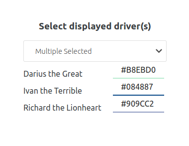
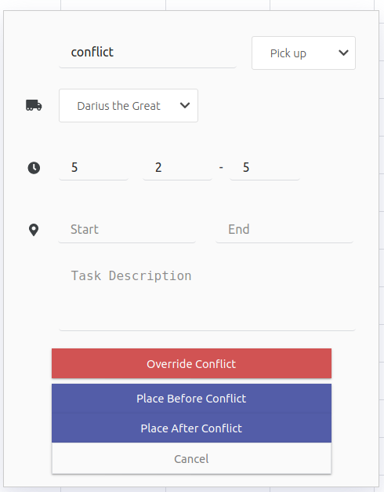

# Bonus Features

## Users can select multiple drivers and view them at the same time

Users can also assign colour to each drivers to better distinguish the tasks each driver is responsible for.
When multiple drivers are selected and each have tasks overlapping with each other, user can hover over the hidden tasks to see them.

## Conflict resolve

Users can auto resolve conflict by overriding, place after conflict or before conflict. There are a few corner cases that I couldn't fully handle.
